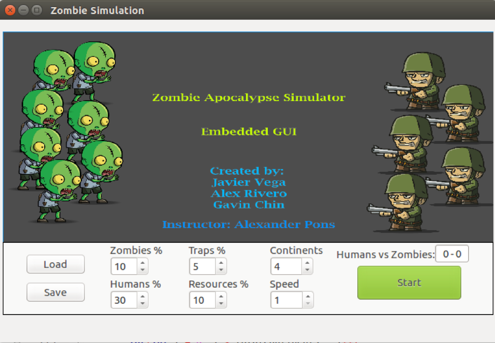
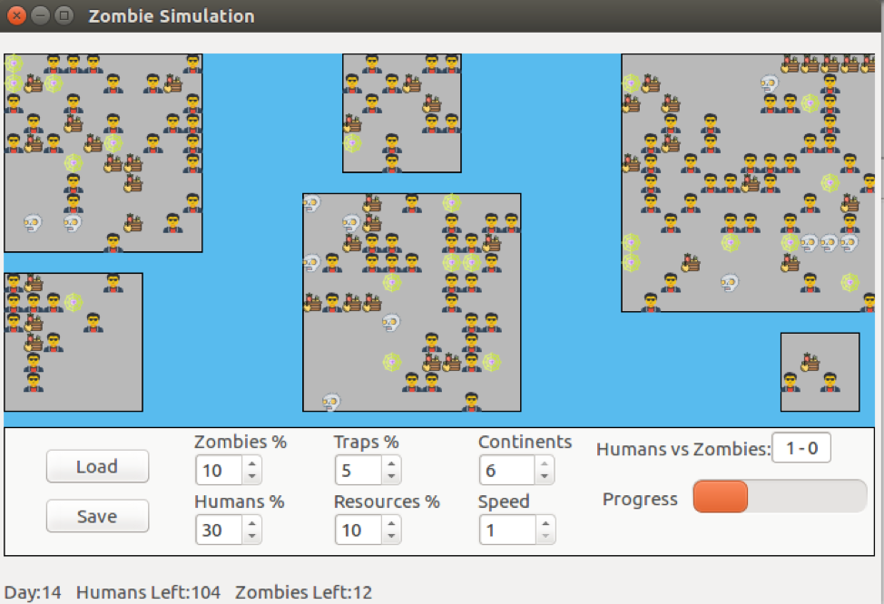
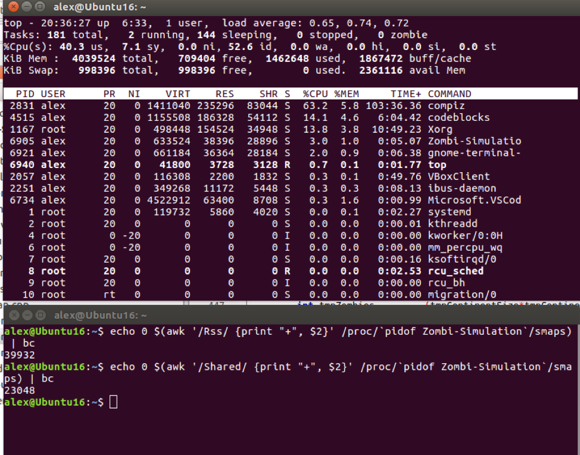

# Multiverse Zombie Apocalypse

## Travis build status: 

### Introduction
This project is an application that simulates an infectious disease, similar to a zombie apocalypse, that spreads throughout the world. The objective is to use tools and skills we learned throughout the semester to create an application that cover several of those topics. The application will be able to run on many of the common operating systems used today such as Windows, Mac OS, and Linux. Also, available to perform and work on ARM or x86 processors.

### Graphical User Interface
We wanted to create a light GUI environment that did not consumed many resources, so we decided to implement the main logic and interactions behind the scenes through our previously introduced classes that way our GUI would only perform the display changes in the continents. With that in mind we made a dynamic GUI with some adjustable parameters the user could interact to appreciate the difference in the results and at the same time the program would dynamically adjust itself to use only the necessary memory to run the application. We also implemented a configuration saving and loading mechanism to allow users to save and load current or previous simulation configurations.

The Initial screen is a menu so that the user can select his or her configuration options before running the simulation. After clicking the start button, the window would change to the world setup with tall the continents and its specified percentage of the different type of cells. The Status Bar shows provides some information about the days passed in the simulations and the amount of Zombies and Humans left in the world. At the end of the simulation, a pop up message would to notify the user of who won the simulated battle and how much percentage of the world they took.

### Main Menu
---

### Running Simulation
***

### Application Resources
***
Because of our defined idea in making a light GUI we were able to obtain great performance on our implementation. At maximum we only used approximately 41MB(39,932KB) of memory, and in respect to the Beaglebone that represents only 8% of its 512MB of RAM. Those values can be obtained in the terminal after running some commands to display memory usage.

### References
+ Testing Framework: [CppUTest](https://github.com/cpputest/cpputest)
+ Continuous Integration: [Travis CI](https://travis-ci.org/getting_started)
